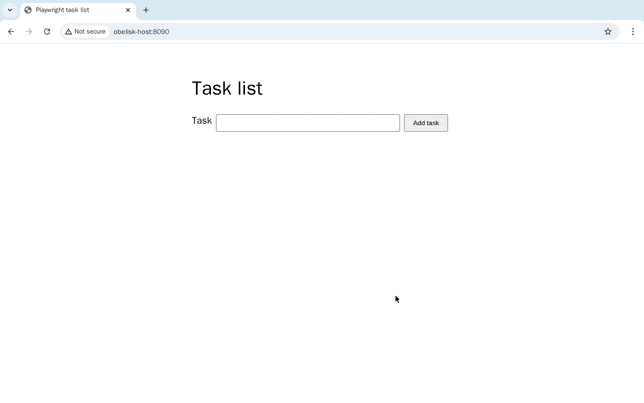
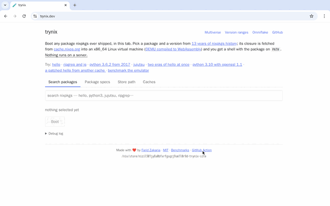

# Playwright browser automation demo

Two [Obelisk](https://obeli.sk) apps drive a Chromium browser with
[Playwright](https://playwright.dev) from durable JavaScript workflows:

- [todoapp/](todoapp/) adds a task to a small task-list page:

  

- [inception/](inception/) opens [trynix.dev](https://trynix.dev/), boots Obelisk in a VM running
  inside the browser tab and returns the output of `obelisk -v`:

  

## How it works

In Obelisk, a [workflow](https://obeli.sk/docs/latest/concepts/workflows/) is deterministic code
that calls [activities](https://obeli.sk/docs/latest/concepts/activities/), which do the actual
work, here driving the browser. Obelisk records every activity result, so a workflow interrupted
by a crash or restart continues where it left off instead of starting over.

Obelisk retries an activity that fails or times out, so activities must be idempotent: running one
twice must have the same effect as running it once. An activity also keeps no state between runs;
all it gets is its parameters. Anything stateful, such as a browser with an open page, lives in an
external resource like a Docker container or a VM. Obelisk can manage such resources: an activity
VM is created and removed for each activity run, and a longer-lived one, like the Docker container
of the multi-step workflows, is provisioned and cleaned up by a workflow (see
[Cleaning up the browser](#cleaning-up-the-browser)).

Each app comes with two workflows:

- **Single step** (`just todoapp`, `just inception`): one activity opens a browser, runs a
  Playwright snippet and closes the browser.
- **Multi step** (`just todoapp-multistep`, `just inception-multistep`): one browser stays open
  in a Docker container while the workflow calls several activities on it, one per step. You can
  watch the browser through VNC and step through the workflow yourself.

The browser runs in one of two places, chosen when you start the server:

- **Docker** (`docker`): Chromium runs in a container built from this repo. Both workflows work.
- **Activity VM** (`vm`): Obelisk starts a fresh virtual machine for each activity and removes it
  afterwards, so only the single-step workflow works.

## Setup

1. Install [Nix](https://nixos.org/download/). For the Docker backend, also start a Docker daemon.
2. Enter the development shell and create an API token for the Obelisk CLI:

   ```sh
   nix develop
   export OBELISK_API_TOKEN=$(obelisk generate token)
   ```

   With [direnv](https://direnv.net), copy `.envrc-example` to `.envrc` and run `direnv allow`
   instead. Every shell that runs `just` needs the same token.
3. For the Docker backend, build the browser image with `just build`.

## Run

Start the server for one app and backend, then run the workflows from another shell as described
in [todoapp/README.md](todoapp/README.md) and [inception/README.md](inception/README.md):

```sh
just serve todoapp docker     # or: just serve todoapp vm
just serve inception docker   # or: just serve inception vm
```

Run one server at a time, since both use the same port.

| Command | Docker | VM |
| --- | --- | --- |
| `just todoapp 'Buy milk'` | yes | yes |
| `just todoapp-multistep 'Buy milk'` | yes | no |
| `just inception` | yes | yes |
| `just inception-multistep` | yes | no |

### Stepping through a workflow

The multi-step commands start the browser, then print the execution ID (`E_...`) of the workflow
that drives it. That workflow is **paused**: it does nothing until you tell it to continue.

- `just advance E_...` calls Obelisk's
  [advance API](https://obeli.sk/docs/latest/cli/#advancing-a-paused-execution), which replays the
  workflow up to its next step, such as calling the next activity, applies that step and keeps the
  workflow paused. The activity itself runs to the end, so wait for the browser to change before
  advancing again.
- `just unpause E_...` lets the workflow run to the end.
- `just cancel E_...` stops it early. The browser is still removed, as described below.

### Cleaning up the browser

A browser container left behind by a failed, cancelled or abandoned run would keep running
forever. The multi-step workflows prevent that with the
[cleanup supervisor](https://obeli.sk/docs/latest/patterns/cleanup-supervisor/) pattern, a saga
whose one compensating step removes the container:

1. An outer workflow, `*-multistep.run`, starts the container.
2. It submits the inner workflow, `*-steps.run-cancellable`, which drives the browser, and a
   one-hour timer. Whichever finishes first wins; if the timer wins, the inner workflow is
   cancelled.
3. The outer workflow removes the container whether the inner one succeeded, failed, was cancelled
   or timed out, and then returns its result.

The `-cancellable` suffix lets the inner workflow be
[cancelled](https://obeli.sk/docs/latest/concepts/structured-concurrency/#cancellation) from
outside, by `just cancel` or the timer, without running any more of its code. The outer workflow
is not cancellable, so its cleanup always runs. Because Obelisk records each step, the cleanup also
runs after a server crash or restart. The execution ID that `just advance` takes is the inner
workflow's; the outer one is printed as `Supervisor`.

### Activity VMs

The VM backend needs a CPU emulator or virtualizer, set with `vm_backend`. The default, `qemu-tcg`,
emulates the CPU in software and works anywhere. On Linux with `/dev/kvm`, `qemu-kvm` is much
faster:

```sh
just vm_backend=qemu-kvm serve inception vm
# or once per shell:
export OBELISK_UNSTABLE_ACTIVITY_VM=qemu-kvm
```

The first start downloads the VM runtime and the browser, which takes a while.

## Layout

- `todoapp/` and `inception/` each hold one app: its workflows, `server.toml`, and an app policy
  (`app-*.toml`) and deployment (`deployment-*.toml`) per backend.
- [runner/](runner/) runs the browser for both apps: [runner/docker/](runner/docker/) holds the
  Docker image and the scripts Obelisk calls as activities, and [runner/vm/](runner/vm/) holds the
  script that runs inside an activity VM.
- [scripts/](scripts/) holds the helpers behind the `just` commands.

## Development

`just verify` and `just verify-vm` check the deployments. `just test-e2e docker` and
`just test-e2e vm` run the todoapp workflows end to end.

Obelisk only runs activity scripts whose digest is approved. After changing a script in
`runner/docker/`, run `just verify` and copy the digests it prints into both apps'
`app-docker.toml` and `server.toml`.

The browser runner is adapted from the MIT-licensed `obeli-sk/components` Playwright component.
