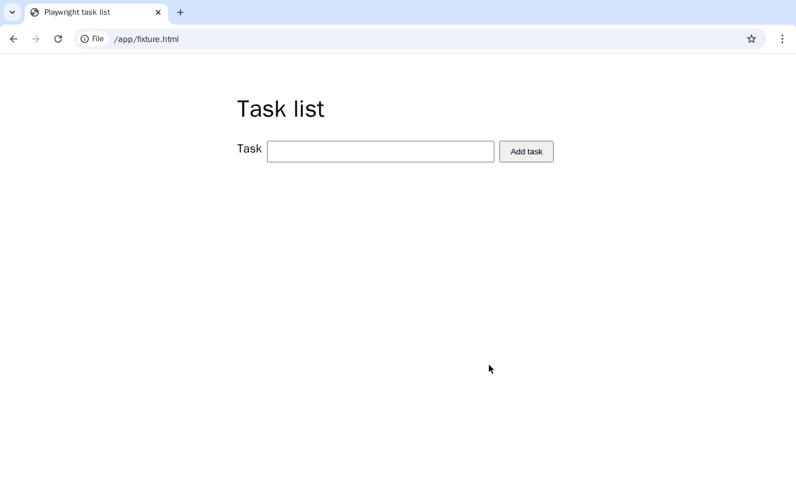
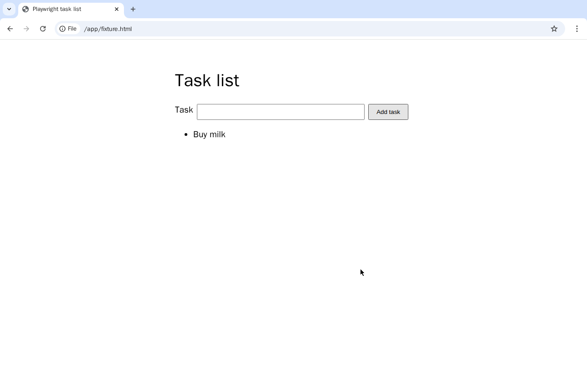

# Todo app

Adds a task to the task-list page in [page/](page/), served from the host at
`http://127.0.0.1:8090/`. See the [top-level README](../README.md) for setup.

```sh
just serve-page &
just serve todoapp docker   # or: just serve todoapp vm
```

## Single step

[workflow/run.js](workflow/run.js) calls `demo:playwright/browser.run` once. It works on both
deployments:

```sh
just todoapp 'Buy milk'
# Execution finished: OK: {"title":"Playwright task list","tasks":["Buy milk"]}
# Activity E_...o:1-run_1: locked at ..., finished at ..., took 1.52s
```

## Multi step (Docker)

[workflow/multistep.js](workflow/multistep.js) starts a headed browser, adds the task, optionally
sleeps, reads the page and removes the container in a `finally` block. Adding checks whether the
task is already present, so a retry cannot add a duplicate.

```sh
just todoapp-multistep 'Buy milk'
# success, current state: Paused(BlockedByJoinSet(o:1-start, ...))
# VNC: 127.0.0.1:5900
# Execution: E_01M3GZGNBXR1RQW3V1SE2QDJMT
```

The workflow is submitted paused and advanced through browser startup. Connect a VNC viewer to the
printed address:



Advance once to add the task (`o:2-eval`):

```sh
just advance E_01M3GZGNBXR1RQW3V1SE2QDJMT
```



Advance again to read the page (`o:3-eval`), then to clean up (`o:4-cleanup`), and once more for
the result. Let each activity finish before advancing. `just unpause E_...` runs the rest without
stopping.

To see recovery across a server restart, pass a pause in seconds, unpause, and stop Obelisk while
the workflow sleeps. After `just serve todoapp docker` it reads the same page and removes the
container:

```sh
just todoapp-multistep 'Write a note' 30
just unpause E_...
```

Set `HEADED=false` when starting the server to run the session browser without Xvfb and VNC.

To retake the screenshots and the GIF in the top-level README, run `just screenshots todoapp` with the page
server and `just serve todoapp docker` running. It drives the multi-step workflow and captures the
browser through VNC before and after the task is added.
